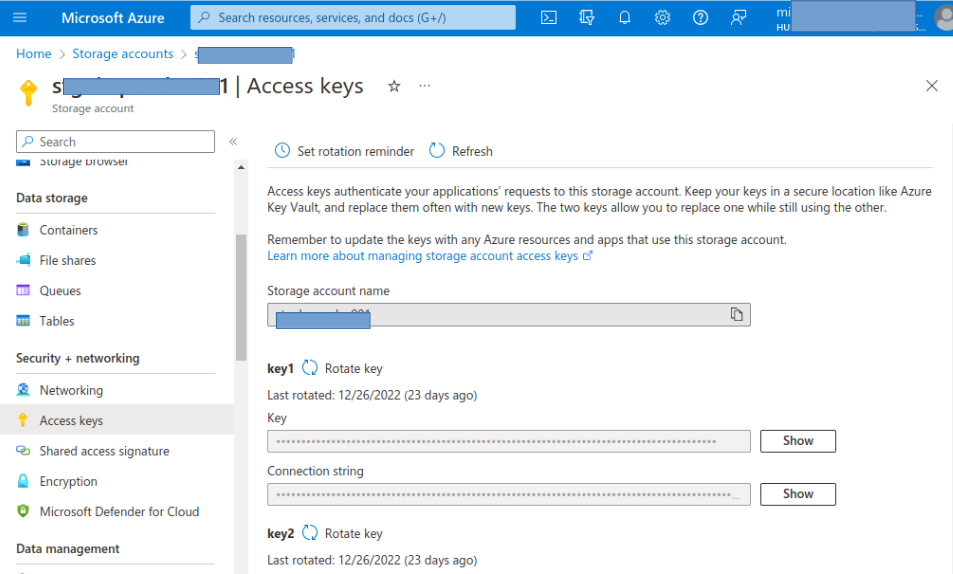

# FastAPI endpoints for handling images stored in Azure Blob Container account.
## Image files.
You can see, download, upload, delete and overlay images files (blobs) stored in an Azure Storage Container.
This can be done with FastAPI, Uvicorn, Pillow (PIL) and Azure Functions.

## How to run endpoints.
<ul>
<li> You can run <strong>pipenv shell</strong> in order to activate your virtual environment. </li>
<li> Install dependencies with <strong>pipenv install</strong> which are defined in <strong>Pipfile</strong> document. </li>
<li> The package <strong>opencv-python</strong> in Linux environments will make you install dependencies on your system, so you need to install <strong>opencv-python-headless</strong> instead. </li>
<li> Finally, run the service with <strong>uvicorn main:app --reload --env-file=.env</strong> . </li>
<li> The .env file contains your <strong>connection string</strong>. You can get it from your Azure storage account in the left menu, "Access keys". In the right side you can see that data hidden. Press the "Show" button and copy that connection string into your .env file.

<li>Don't forget to install <strong>python-dotenv</strong> package and not <strong>dotenv</strong> packege only. This allow you to use your environment variables with the getenv function. Use https://pypi.org to know the exact command to install the desired package. If you type in your browser "dotenv pypi" you'll see the results showing the url for the pypi website with tha package name. </li>
</ul>

## How to handle endpoints.
- Once your server is running with Uvicorn you'll see that it's running in http://127.0.0.1:8000.
- Add /docs at the end to open the Swagger interactive API documentation where you can test your functions and debug any detail.
